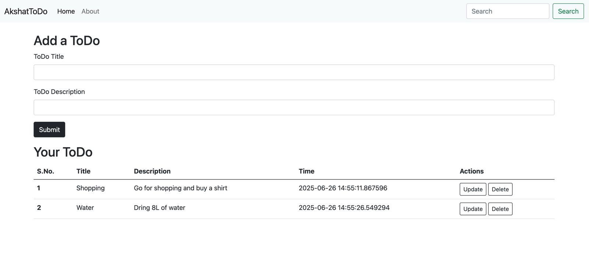

# 📝 AkshatToDo - Flask To-Do Web App


Welcome to **AkshatToDo** — a sleek and simple To-Do app built with Flask.  
Create, view, update, and delete your daily tasks with ease. Built using Python, Flask, and SQLite!

---

## 🚀 Features

- ✅ Add new tasks
- 🕒 Track when tasks were created
- ✏️ Edit/update existing tasks
- 🗑️ Delete tasks with a single click
- 📦 Lightweight and beginner-friendly
- 🎨 Clean UI powered by Bootstrap

---

## 📸 Screenshots

### 🏠 Home Page  


---

## 🛠️ Tech Stack

- Python 3.12+
- Flask
- SQLite
- HTML + Bootstrap 5

---

## 💻 Run Locally

Clone the repo and follow the steps:

```bash
git clone https://github.com/akshatkh18/AkshatToDo.git
cd AkshatToDo
python -m venv env
source env/bin/activate  # For Mac/Linux
# OR
env\Scripts\activate     # For Windows

pip install -r requirements.txt
python app.py
```

## 📁 Project Structure

<pre>
AkshatToDo/
├── app.py
├── requirements.txt
├── templates/
│   ├── base.html
│   ├── index.html
│   └── update.html
├── static/
├── instance/
│   └── todo.db
├── env/
├── screenshots/
│   ├── todo-home.png
│   └── todo-update.png
└── .gitignore
</pre>

---

## 🤝 **Contributing** 

Pull requests are welcome! If you spot a bug or have a feature idea, feel free to open an issue or submit a PR.


## 📬 Feedback

If you found this project helpful or cool, give it a ⭐ on GitHub!  
For feedback, reach out on [LinkedIn](https://linkedin.com/in/akshat-gupta18/).
